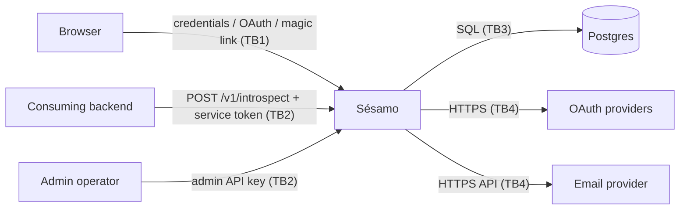

# Sésamo Threat Model

Structured after Adam Shostack, *Threat Modeling: Designing for Security*
(Wiley, 2014): the four questions, with STRIDE-per-element answering
question 2. This document is the system of record for security
decisions; `internal/http/threat_test.go` is its executable half. When
you add an attack surface, update BOTH.

## 1. What are we working on?

A single Go binary issuing opaque browser sessions and answering
service-to-service introspection, backed by Postgres.

Trust boundaries:

| # | Boundary | Crossing |
|---|---|---|
| TB1 | Internet → Sésamo | Anonymous browsers: credentials, tokens in links, cookies, forged headers |
| TB2 | Backend/operator → Sésamo | Bearer service token / admin key |
| TB3 | Sésamo → Postgres | Only hashes of secrets are stored; DB compromise must not yield usable tokens |
| TB4 | Sésamo → providers | OAuth code exchange, email dispatch; provider compromise ≠ Sésamo compromise |

Assets, in priority order: (1) session validity — a forged/stolen "active"
answer is full account takeover; (2) password hashes; (3) PII (emails,
names); (4) availability of the introspect hot path.

## 2. What can go wrong? (STRIDE per element)

### S — Spoofing
| Threat | Mitigation | Evidence |
|---|---|---|
| Forged session token | 256-bit random, SHA-256 stored, exact hash lookup | Threat03 |
| Caller without/with wrong service token | constant-time bearer check | Threat01, Threat02 |
| OAuth login CSRF (attacker's `state`) | state cookie + `SafeEqual`, PKCE | Threat09 |
| Client IP spoofing via `X-Forwarded-For` | XFF ignored unless `SESAMO_TRUST_PROXY` | Threat17 |
| Password guessing | Argon2id, per-IP (20/min) + per-identity (5/min) buckets | Threat13 |

### T — Tampering
| Threat | Mitigation | Evidence |
|---|---|---|
| One-time token replay | atomic `UPDATE … RETURNING`, single use | Threat10 |
| Open redirect after login/logout | `safeRedirectTarget`: internal paths plus the exact-match `SESAMO_REDIRECT_ORIGINS` allowlist; protocol-relative, backslash, userinfo, lookalike-host, and port-mismatch targets collapse to `/` | Threat15, TestSafeRedirectTarget, Flows 07-11 |
| Session fixation | login always mints a fresh token; `Rotate` on privilege change | session tests |
| Stolen session kept alive by renewal | `expires_at` renewal is capped at `created_at + SESAMO_SESSION_MAX_LIFETIME_DAYS` (90 days default) | session max-lifetime tests |
| Rate-limit oversubscription under concurrency | refill+consume in one transaction (row lock) | ratelimit concurrency test |

### R — Repudiation
| Threat | Mitigation | Evidence |
|---|---|---|
| "I never logged in / that wasn't me" | `audit_log`: login success/fail, signup, logout, resets, verifications, revocations and account disable/enable — actor, IP, JSONB detail | Threat18, Threat24 |
| Attacker erases evidence by hanging up | audit insert survives request-context cancellation | `audit.Record` |
| Secrets leaking into evidence | audit detail carries emails/methods only — never tokens, hashes, passwords | code review rule |
| Action without evidence in compliance mode | `SESAMO_AUDIT_STRICT`: password/OAuth/magic login, signup, reset, logout and disable perform their state mutation and audit row in one DB transaction; either both commit or neither does | Threat20, `RecordTx`, store Tx tests |

Deliberately NOT audited: `/v1/introspect` (every protected request; access
log + metrics cover it). Audit write failures are a configurable tradeoff:
by default best-effort (a DB failure logs a warning and the auth operation
proceeds — availability wins); with `SESAMO_AUDIT_STRICT` the state-changing
flow rolls back instead. Exception: the anti-enumeration paths (`/reset`,
`/magiclink`, signup) retain their generic response if strict audit fails, so
an audit outage cannot become an account-existence oracle.

Residual accepted risk: OAuth user upsert owns its own transaction, then
session creation plus `login.success` share a second transaction. A strict
audit failure may therefore leave a newly linked/created OAuth identity
without a session or `login.success` event. It never creates an active
session without evidence; eliminating the residual requires moving
`UpsertByOAuth` into the outer use-case transaction.

### I — Information disclosure
| Threat | Mitigation | Evidence |
|---|---|---|
| User enumeration via login / reset / signup | identical errors, dummy Argon2id work, always-200 where required | Threat04-06 |
| Disabled account access | `users.disabled` blocks password, OAuth and magic links; disable revokes every session and introspection returns inactive | Threat24 |
| Self-service signup on a private deployment | `SESAMO_SIGNUP=disabled`: stable 403 on /signup without touching the DB; OAuth refuses brand-new accounts (`user.ErrSignupDisabled`) while existing users keep logging in; rejections audited as `signup.rejected` | Flow12, TestUpsertRespectsSignupPolicy |
| Token theft from DB / backups | only SHA-256(token) stored; Argon2id PHC for passwords | schema |
| XSS exfiltrating the cookie | HttpOnly + strict CSP (no inline scripts) + nosniff | Threat16 |
| Secrets in logs | logging/recovery middleware never logs headers, cookies or bodies; panic value is recorded only by type | code review rule |

### D — Denial of service
| Threat | Mitigation | Evidence |
|---|---|---|
| Credential-endpoint floods | Postgres-backed token buckets (multi-instance safe) | Threat13 |
| Oversized request bodies | 64 KiB `MaxBytesReader` on every request | Threat19 |
| Slow POST / slow response / idle connection | `ReadHeaderTimeout` 10 s, `ReadTimeout` + `WriteTimeout` 30 s, `IdleTimeout` 120 s | serve.go |
| Slow OAuth, JWKS or email provider | bounded shared HTTP client: dial/TLS 5 s, response header 10 s, total 15 s; decoded response caps | `internal/httpx`, provider tests |
| Handler panic | recovery middleware emits 500 before any output, panic metric, stack and request ID; action transactions roll back | Resilience01 |
| Unbounded table growth (abandoned sessions, dead tokens, stale buckets — incl. bucket-minting via spoofed keys) | hourly maintenance purge | purge tests |
| Rate-limiter DB failure locks everyone out | fails OPEN by design — brute-force protection degrades, login stays up. Accepted: a DB brownout weakens throttling exactly when checks are slowest; per-identity Argon2id cost still applies | ratelimit.go comment |

### E — Elevation of privilege
| Threat | Mitigation | Evidence |
|---|---|---|
| Service token used on admin API | separate keys, both constant-time; production requires distinct 32+ character values | Threat11, Threat12 |
| CSRF logout / state-changing GETs | POST-only mutations + CSRF double-submit token | Threat14, Threat21-23 |
| Login CSRF | `sesamo_csrf` HttpOnly cookie must match form `csrf_token` or `X-CSRF-Token`, constant-time; SameSite=Lax/CSP remain defense in depth | Threat21-23 |
| Unconfigured admin API | 503 when `SESAMO_ADMIN_API_KEY` empty — no fallback key | admin.go |

## 3. What are we going to do about it?

Strategy per Shostack: mitigate by default; accept only with a written
rationale. Accepted: the fail-open rate limiter (row above). Configurable:
audit write failures (best-effort by default, mandatory under
`SESAMO_AUDIT_STRICT` — see the Repudiation section). Nothing is
transferred; nothing avoided by dropping features.

## 4. Did we do a good job?

Validation is executable: every mitigation row above names a test in
`internal/http/threat_test.go` or a store-level test. `go test ./...`
runs all of them; the suite is hermetic (re-runs are clean). The load
test pins the hot-path SLO (p50 < 5 ms, p99 < 20 ms). Re-ask the four
questions whenever a route, header, or table is added — and when V2/OIDC
is ever unfrozen, model it BEFORE building it.

## Auth0-parity notes (V1 scope)

Covered: brute-force protection (Auth0 "attack protection"), audit trail
(Auth0 "logs"), anti-enumeration, session revocation, import path.
Known deltas, deliberate for V1: no anomaly/breached-password detection
(would need an external corpus — candidate: HIBP k-anonymity range API,
env-gated, stdlib-only), no MFA/WebAuthn (V2 candidate), no log
streaming (the `audit_log` table + Prometheus `/metrics` are the
integration points).
